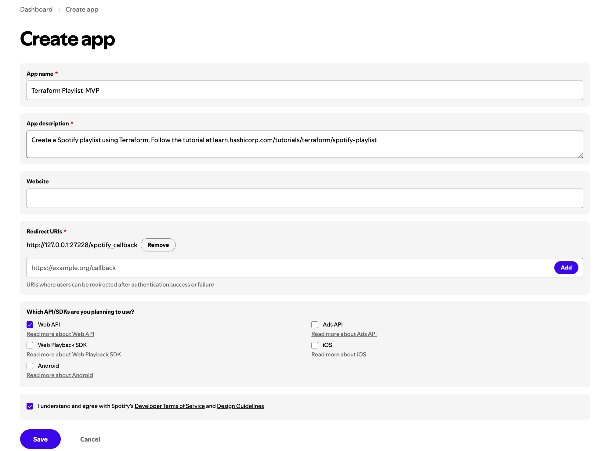

## Prerequisites
To complete this tutorial, you will need:

- Terraform version 1.0+
- Docker Desktop
- [Spotify account with developer ] access (https://developer.spotify.com/)


### Create Spotify developer app




### Run authorization server


```sh

export SPOTIFY_CLIENT_REDIRECT_URI=http://localhost:27228/spotify_callback

touch .env #file zith below content.
SPOTIFY_CLIENT_ID=
SPOTIFY_CLIENT_SECRET=

```

- Make sure Docker Desktop is running, and start the server. It will run in your terminal's foreground.

### If using HPC Terraformm then configure a NGROK on local machine running the auth-proxy server

```sh

## If on MAC system, install below package to emulate the build
sudo apt-get install qemu-user-static binfmt-support

podman run --rm -it -p 27228:27228 --env-file ./.env ghcr.io/conradludgate/spotify-auth-proxy
## OUTPUT:

#WARNING: image platform (linux/amd64) does not match the expected platform (linux/arm64)
#APIKey:   0t0Y65qHNR1WnPgQ2NIWFCNq04K4pf6Vf4TeCUhhyCZJJFQzY
#Auth URL: http://localhost:27228/authorize?token=mtGZ0pTY8cU7fsYarbhgNgK8xRO_PnYGT2UwX688ToaOZ1K


## Clain a static domain on Ngrok
ngrok http --url=eldon-uninfringed-rayna.ngrok-free.app 80

ngrok http 27228 --subdomain=eldon-uninfringed-rayna.ngrok-free.app

```

- Provider configuration


```terraform
terraform {

  cloud {  # disabled HCP remote state to use local state
     organization = "prod-tdmund-tf"

     workspaces {
       name = "lab03-spotify-tf"
     }
}

  required_providers {
    spotify = {
      version = "~> 0.2.7"
      source  = "conradludgate/spotify"
    }
  }
} 

provider "spotify" {
  auth_server = var.spotify_auth_server
  api_key     =  var.spotify_api_key
}

```


### If using local state of Terraform


```sh
export SPOTIFY_CLIENT_REDIRECT_URI="https://192.168.64.4:27228/spotify_callback"
podman run --rm -it -p 27228:27228 --platform linux/arm64 --env-file ./.env ghcr.io/conradludgate/spotify-auth-proxy

## OUTPUT:
#WARNING: image platform (linux/amd64) does not match the expected platform (linux/arm64)
#APIKey:   g2_jp1bG5lwJBG6rHp_8sU4CnaxGAcYoDeO2mzdqXusgccOhH1mocv
#Auth URL: http://localhost:27228/authorize?token=QLpcuBM_Oz9GTzmdP9vRebNxmDS4v4rQrGxqJF6NoAVX8N
```

- Provider configuration

```terraform
terraform {
  required_providers {
    spotify = {
      version = "~> 0.2.7"
      source  = "conradludgate/spotify"
    }
  }
} 

provider "spotify" {
  auth_server = var.spotify_auth_server
  api_key     = "g2_jp1bG5lwJBG6rHp_8sU4CnAcYoDeO2mzdqXusg"
  token_id    = "QLpcuBM_Oz9GTzmdP9vReGNgzS475bN4v4rQJF6NoAVX8N"
}

```