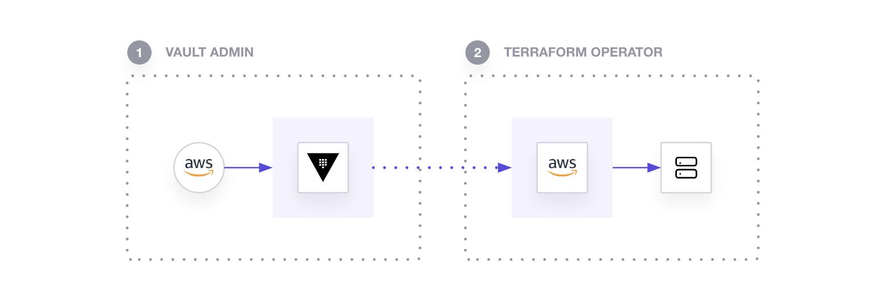

- In this tutorial, you assume the role of both the Vault Admin and the Terraform Operator.

- As a result, operators (Vault Admin) are able to avoid managing static, long-lived secrets with varying scope and developers (Terraform Operator) are able to provision resources without having direct access to the secrets.

1. First, as a Vault Admin, you will configure AWS Secrets Engine in Vault.

2. Then, as a Terraform Operator, you will connect to the Vault instance to retrieve dynamic, short-lived AWS credentials generated by the AWS Secrets Engine to provision an Ubuntu EC2 instance.

3. Finally, as a Vault Admin, you will remove the Terraform Operator's ability to manipulate EC2 instances by modifying the policy for the corresponding Vault role.

### Prerequisites

- Terraform installed locally

- Vault installed locally

- an AWS account and AWS Access Credentials: If you don't have AWS Access Credentials, create your AWS Access Key ID and Secret Access Key by navigating to your service credentials in the IAM service on AWS. Click "Create access key" here to view your AWS_ACCESS_KEY_ID and AWS_SECRET_ACCESS_KEY. You will need these values later.

---
#### Start Vault server

vault server -dev -dev-root-token-id="education"
---

#### Configure local 

export TF_VAR_aws_access_key=<AWS_ACCESS_KEY_ID>
export TF_VAR_aws_secret_key=<AWS_SECRET_ACCESS_KEY>
export VAULT_ADDR=http://127.0.0.1:8200
export VAULT_TOKEN=education