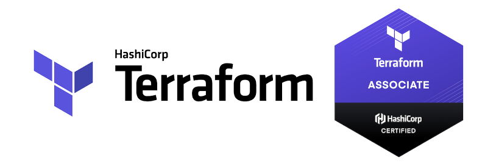

# HashiCorp Certified Terraform Associate - Study Guide, Practice & Exam Tips

## Description

HashiCorp Associate Certification exams consists of multiple choice, multiple answer, true/false, and other question types.

## Context

After passing the Terraform Associate exam, I wanted to help others preparing for it, so I created a Udemy practice course. Here, I'll share my preparation experience for anyone looking to get certified.
This exam goes beyond just writing Terraform code—it tests your ability to:

1. **Understand Infrastructure as Code (IaC) concepts**
2. **Manage the Terraform lifecycle**
3. **Use Terraform Cloud**
4. **Troubleshoot real-world scenarios**

My preparation took about 1 to 4 weeks, broken down as follows:

- 📘 **1 week** studying Terraform fundamentals using the [official HashiCorp Learn portal](https://developer.hashicorp.com/terraform/learn)  
- 🧠 **2-3 week** doing hands-on labs and building infra in AWS/Azure using Terraform  
- 🧪 **Final week** with this **[Udemy terraform Practice Tests](https://www.udemy.com/course/terraform-certified-associate-003-practice-exams/)** and  analyzing mistakes, and reviewing the [Terraform documentation](https://developer.hashicorp.com/terraform/docs)  

---

## 🧭 Preparation Tips

- ✅ **Hands-On Practice** – Build real infrastructure (S3, VMs, security groups) to reinforce concepts.

- ✅ **Master CLI Commands** – Focus on terraform commands  like `init`, `plan`, `apply`, `destroy`, `taint`, `import`, `refresh`, and `state` — these are exam favorites!

- ✅ **Study Smart** – Use the official HashiCorp Learn tutorials (they mirror real exam questions).

- ✅ Test Like the Real Exam – My **Udemy practice exams** cover 75–80% of the actual exam’s structure and topics.

- ✅ Create a **cheat sheet** or flashcards of commands, file structure (`main.tf`, `variables.tf`, `terraform.tfvars`), and backend configuration  

---

## 📌 High-Priority Topics

### 📂 Core Terraform Concepts
- IaC fundamentals  
- Terraform workflow: `init`, `plan`, `apply`  
- Execution plan and state file behavior  
- Resource vs Data blocks  

### 📦 Terraform State
- Purpose of the state file  
- Remote backends (S3, Terraform Cloud, etc.)  
- State locking, state file security, `terraform state` commands  

### 🔁 Variables & Outputs
- Input variables (`var.<name>`) and types  
- Output values  
- Terraform vars file `tfvars`
- `locals`, `count`, `for_each`, `depends_on`, `dynamic` blocks  

### ⚙️ Modules
- Creating and using modules  
- `source`, `version`, and input/output handling  
- Public vs private module registry  

### 🧪 Terraform CLI
- `terraform fmt`, `validate`, `get`, `import`, `output`  
- `terraform workspace`, `terraform state` subcommands  

### ☁️ Terraform Cloud & Enterprise
- Organizations, Workspaces, VCS-driven workflows  
- Remote operations, CLI-driven runs  
- Sentinel, cost estimation basics  

### 🔐 Authentication & Provisioning
- Provider configurations and authentication (e.g., AWS creds)  
- Provisioners (file/remote-exec), templatefile  
- Resource lifecycle meta-arguments: `create_before_destroy`, `prevent_destroy`, `ignore_changes`, `replace_triggered_by`

---

## 🧪 Exam-Day Strategies

1. 🍁 **Target 85%+ in Udemy mock tests**  

2. ⚡ **Master key topcis** and Revise `terraform.tfstate`, `backend`, `workspaces`, and modules before the test  

3. 🍁 **Stay calm** — Questions are concise but **demand deep understanding** and they are not lengthy 

4. ⚡ **Use the scratchpad** - Eliminate wrong answers systematically 

5. 🍁 **Think like HashiCorp** — The simplest, most documented solution is usually right 

6. ⚡ Focus on **real-world usage** — The exam tests practical skills, not just syntax

- - -

## 🚀 Tools That Helped Me

- [HashiCorp Learn](https://developer.hashicorp.com/terraform/learn)  
- [Terraform Documentation](https://developer.hashicorp.com/terraform/docs)  
- [Udemy Terraform Practice Exams](https://www.udemy.com/course/terraform-certified-associate-003-practice-exams/?couponCode=KEEPLEARNING)  
- Terraform CLI + AWS Free Tier/Azure Sandbox  

- - -

## 💡 Pro Tip: Learn the "Why" Behind Terraform

> *Memorizing won't cut it! The exam tests your real understanding of Terraform's behavior.*
